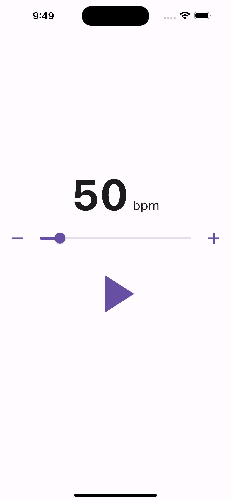

# metronome

[](https://codemagic.io/apps/6476fbcecc925faf465642c6/ci/latest_build)

Métronome réalisé avec [Flutter](https://flutter.dev/).



## Générer l'icône de démarrage

```
flutter pub run flutter_launcher_icons
```
